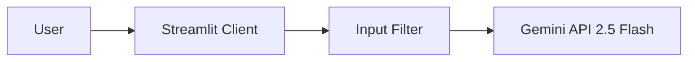

# Guardian AI - Legal Compliance Platform

**個人情報・消費者保護特化型 IT法務チェッカー**

Google Gemini API (2.5 Flash) およびファインチューニング済みLLMを活用した、IT法務リスク判定システム。開発仕様書やサービス設計案を入力することで、法的リスク、関連法規、推奨アクションを即座に提示します。

## プロジェクト概要

このプロジェクトは、AIを活用して開発段階における法的リスクを早期発見（シフトレフト）することを目的としたWebアプリケーションです。

現在はプロトタイプフェーズとして、推論エンジンに「Gemini 2.5 Flash」を採用し、高速かつ高精度な診断を実現しています。将来的には、特定の法務ドメインでファインチューニングを行った独自のローカルLLM（Elyza-7Bベース）への切り替えも可能なアーキテクチャを採用しています。

### 主な特徴

* **即時リスク診断**: 仕様テキストを入力するだけで、数秒以内に「High/Medium/Low」のリスク判定を行います。
* **具体的根拠の提示**: 判定理由とともに、日本の法律（個人情報保護法、資金決済法など）に基づいた法的根拠を提示します。
* **洗練されたUI/UX**:
    * **Quick Demo**: ワンクリックで典型的なリスク事例を呼び出し可能。
    * **History**: 過去の診断結果をサイドバーに自動保存し、いつでも振り返り可能。
    * **English/Japanese Support**: グローバルな開発現場を想定した英語UI（一部）。
* **構造化データ出力**: AIの回答をJSON形式で制御し、安定した出力を保証しています。

---

## 対応範囲

本システムは以下の領域における診断に特化しています。

### 対応可能な領域
1.  **個人情報保護** (データの収集・利用・第三者提供、同意取得)
2.  **消費者保護** (ダークパターン、不当な解約フロー、有利誤認表示)
3.  **アクセシビリティ** (ウェブアクセシビリティ、障害者差別解消法)
4.  **金融規制** (資金決済法、ポイント・コイン発行、暗号資産)
5.  **契約法務** (利用規約の不当条項、信義則違反)

### 対応範囲外
* OSSライセンスの互換性判定
* 高度なAI倫理・バイアス判定
* プログラミングコードのセキュリティ診断

---

## システム構成

### アーキテクチャ

現在はStreamlitとGemini APIを直接接続する構成で稼働しています。入力データはAPI経由で処理されますが、コード内の関数を切り替えることでローカルモデルへの換装が可能です。



### ディレクトリ構成

ソースコード(`src`)とリソース(`assets`)を分離し、保守性を高めた構成です。

```text
ai-legal-advisor/
├── assets/                  # アプリケーション画像リソース (ロゴ等)
├── docs/                    # ドキュメント・スクリーンショット
│   └── images/              # (top_view.png, result_high_risk.png等を格納)
├── src/                     # ソースコード
│   ├── app_gemini.py        # メインアプリケーション (API版エントリーポイント)
│   ├── input_filter.py      # 入力フィルタリングモジュール
│   └── check_models.py      # 利用可能モデル確認用スクリプト
├── .env                     # 環境変数設定 (API Key等)
└── notebooks                # Colabでのログ,テスト結果
```

---

## セットアップと実行

### 前提条件
* Python 3.10以上
* Google API Key (Gemini)

### インストール手順

1.  **リポジトリのクローン**
    ```bash
    git clone [repository_url]
    cd ai-legal-advisor
    ```

2.  **依存パッケージのインストール**
    ```bash
    pip install -r requirements.txt
    ```

3.  **環境変数の設定**
    ルートディレクトリに `.env` ファイルを作成し、APIキーを設定します。
    ```env
    GOOGLE_API_KEY=your_api_key_here
    # TUNED_MODEL_ID=tunedModels/your-model-id (FTモデル使用時のみ)
    ```

4.  **アプリケーションの起動**
    `src` フォルダ内のスクリプトを指定して起動します。
    ```bash
    streamlit run src/app_gemini.py
    ```

---

## 開発ステータス

### 実装済み
- [x] Streamlitによるモダンなチャット形式UIの実装
- [x] Gemini 2.5 Flash APIとの連携とエラーハンドリング(429対策)
- [x] サイドバーへの履歴保存機能 (Session State管理)
- [x] JSON形式での構造化データ出力とパース処理
- [x] フォルダ構成の最適化 (src/assets分離)

### 今後のロードマップ
- [ ] ファインチューニング済みモデル(Elyza-7B)のローカル推論統合
- [ ] 診断履歴の永続化 (SQLite/CSV)
- [ ] レポートのPDF出力機能

---

## 使用技術

* **Frontend**: Streamlit
* **LLM API**: Google Gemini API (gemini-2.5-flash)
* **Design**: Custom CSS styling
* **Language**: Python 3.10+

---

## ライセンス

MIT License

*最終更新: 2026年1月21日*
